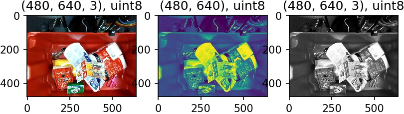

# imgviz: Image Visualization Tools

## Installation

```bash
pip install imgviz
```

## [Examples](examples)

<table>
<tbody>
<tr><td><pre>examples/tile.py</pre>     </td><td>     </td></tr>
<tr><td><pre>examples/color.py</pre>    </td><td>    </td></tr>
<tr><td><pre>examples/depth2rgb.py</pre></td><td></td></tr>
<tr><td><pre>examples/centerize.py</pre></td><td></td></tr>
<tr><td><pre>examples/resize.py</pre>   </td><td>   </td></tr>
<tr><td><pre>examples/rectangle.py</pre></td><td></td></tr>
</tbody>
</table>
