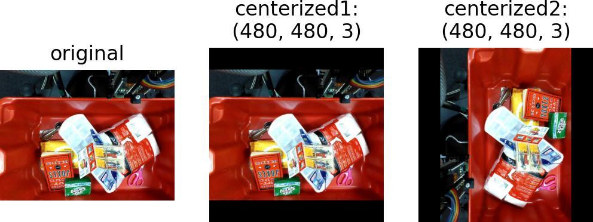
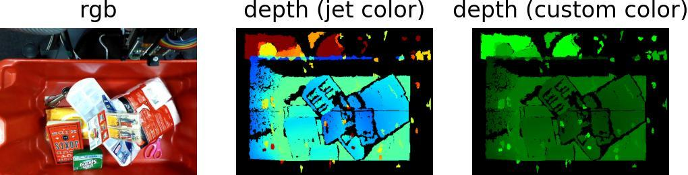

# imgviz: Image Visualization Tools

[](https://pypi.python.org/pypi/imgviz)
[](https://pypi.org/project/imgviz)
[](https://travis-ci.com/wkentaro/imgviz)

## Installation

```bash
pip install imgviz
```

## [Examples](examples)

<table>
	<tr>
		<td><pre>examples/tile.py</pre></td>
		<td></td>
	</tr>
	<tr>
		<td><pre>examples/rectangle.py</pre></td>
		<td></td>
	</tr>
	<tr>
		<td><pre>examples/centerize.py</pre></td>
		<td></td>
	</tr>
	<tr>
		<td><pre>examples/color.py</pre></td>
		<td></td>
	</tr>
	<tr>
		<td><pre>examples/depth2rgb.py</pre></td>
		<td></td>
	</tr>
	<tr>
		<td><pre>examples/resize.py</pre></td>
		<td></td>
	</tr>
</table>
