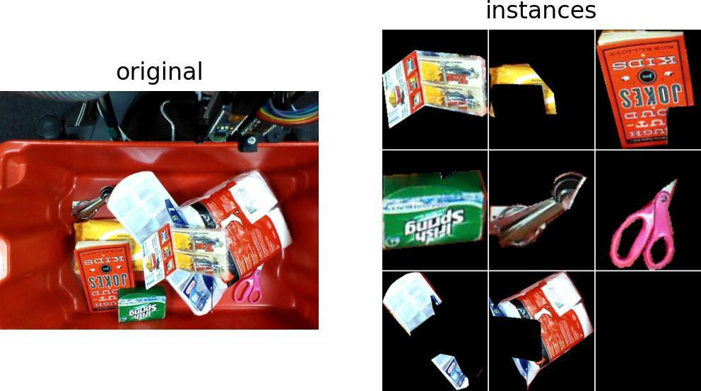

<!-- DO NOT EDIT THIS FILE MANUALLY. This file is generated by generate_readme.py. -->

# imgviz: Image Visualization Tools

[](https://pypi.python.org/pypi/imgviz)
[](https://pypi.org/project/imgviz)
[](https://travis-ci.com/wkentaro/imgviz)

## Installation

```bash
pip install imgviz
```


## Dependencies

- [matplotlib](https://pypi.org/project/matplotlib)
- [numpy](https://pypi.org/project/numpy)
- [Pillow](https://pypi.org/project/Pillow)
- [pyglet](https://pypi.org/project/pyglet)

## Getting Started

```python
# getting_started.py

import imgviz


# sample data of rgb, depth, class label and instance masks
data = imgviz.data.arc2017()

# colorize depth image with JET colormap
depthviz = imgviz.depth2rgb(data['depth'], min_value=0.3, max_value=1)

# colorize label image
labelviz = imgviz.label2rgb(data['class_label'], label_names=data['class_names'])

# tile instance masks
bboxes = data['bboxes'].astype(int)
insviz = [data['rgb'][b[0]:b[2], b[1]:b[3]] for b in bboxes]
insviz = imgviz.tile(imgs=insviz, border=(255, 255, 255))

# tile visualization
tiled = imgviz.tile(
    [data['rgb'], depthviz, labelviz, insviz],
    shape=(1, 4),
    border=(255, 255, 255),
)
```


## [Examples](examples)

<table>
	<tr>
		<td><pre><a href="examples/centerize.py">examples/centerize.py</a></pre></td>
		<td></td>
	</tr>
	<tr>
		<td><pre><a href="examples/depth2rgb.py">examples/depth2rgb.py</a></pre></td>
		<td></td>
	</tr>
	<tr>
		<td><pre><a href="examples/draw.py">examples/draw.py</a></pre></td>
		<td></td>
	</tr>
	<tr>
		<td><pre><a href="examples/label2rgb.py">examples/label2rgb.py</a></pre></td>
		<td></td>
	</tr>
	<tr>
		<td><pre><a href="examples/resize.py">examples/resize.py</a></pre></td>
		<td></td>
	</tr>
	<tr>
		<td><pre><a href="examples/tile.py">examples/tile.py</a></pre></td>
		<td></td>
	</tr>
</table>
