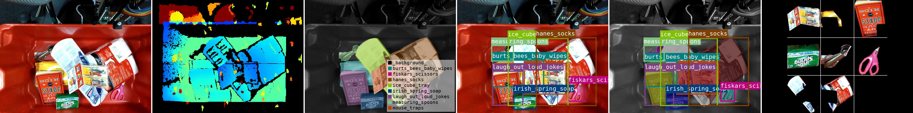
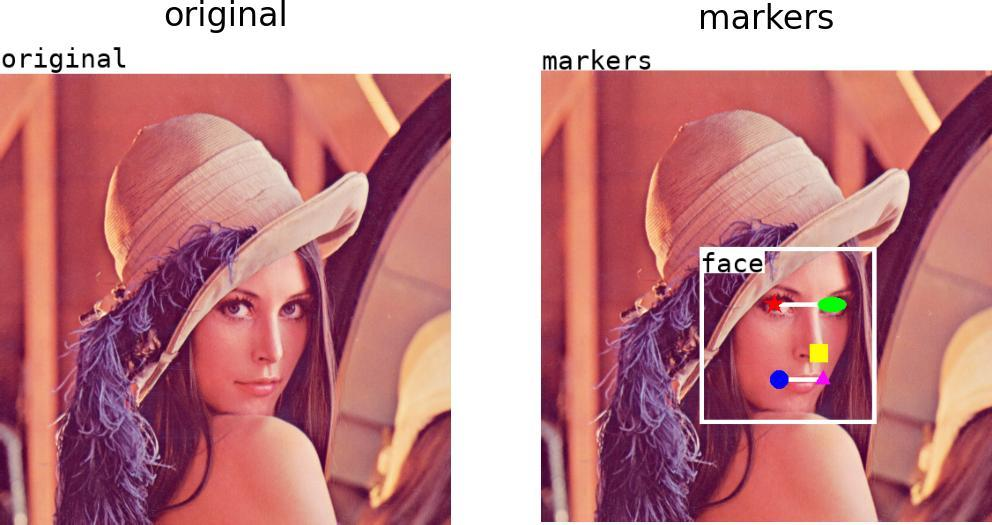
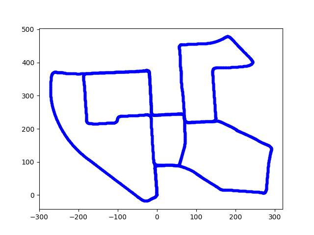

<!-- DO NOT EDIT THIS FILE MANUALLY. This file is generated by generate_readme.py. -->

# imgviz: Image Visualization Tools

[](https://pypi.python.org/pypi/imgviz)
[](https://pypi.org/project/imgviz)
[](https://travis-ci.com/wkentaro/imgviz)

## Installation

```bash
pip install imgviz
```


## Dependencies

- [matplotlib](https://pypi.org/project/matplotlib)
- [numpy](https://pypi.org/project/numpy)
- [Pillow](https://pypi.org/project/Pillow)
- [scikit-image](https://pypi.org/project/scikit-image)

## Getting Started

```python
# getting_started.py

import imgviz


# sample data of rgb, depth, class label and instance masks
data = imgviz.data.arc2017()

# colorize depth image with JET colormap
depthviz = imgviz.depth2rgb(data['depth'], min_value=0.3, max_value=1)

# colorize label image
labelviz = imgviz.label2rgb(data['class_label'], label_names=data['class_names'])

# instance bboxes
bboxes = data['bboxes'].astype(int)
captions = [data['class_names'][l] for l in data['labels']]
bboxviz = imgviz.instances2rgb(
    image=data['rgb'], bboxes=bboxes, labels=data['labels'], captions=captions
)

# instance masks
masks = data['masks'] == 1
maskviz = imgviz.instances2rgb(
    image=data['rgb'], masks=masks, labels=data['labels'], captions=captions
)

# tile instance masks
insviz = [
    (data['rgb'] * mask[:, :, None])[y1:y2, x1:x2]
    for (y1, x1, y2, x2), mask in zip(bboxes, masks)
]
insviz = imgviz.tile(imgs=insviz, border=(255, 255, 255))

# tile visualization
tiled = imgviz.tile(
    [data['rgb'], depthviz, labelviz, bboxviz, maskviz, insviz],
    shape=(2, 3),
    border=(255, 255, 255),
)
```



## [Examples](examples)

<table>
	<tr>
		<td><pre><a href="examples/centerize.py">examples/centerize.py</a></pre></td>
		<td></td>
	</tr>
	<tr>
		<td><pre><a href="examples/depth2rgb.py">examples/depth2rgb.py</a></pre></td>
		<td></td>
	</tr>
	<tr>
		<td><pre><a href="examples/draw.py">examples/draw.py</a></pre></td>
		<td></td>
	</tr>
	<tr>
		<td><pre><a href="examples/flow.py">examples/flow.py</a></pre></td>
		<td></td>
	</tr>
	<tr>
		<td><pre><a href="examples/instances2rgb.py">examples/instances2rgb.py</a></pre></td>
		<td></td>
	</tr>
	<tr>
		<td><pre><a href="examples/label2rgb.py">examples/label2rgb.py</a></pre></td>
		<td></td>
	</tr>
	<tr>
		<td><pre><a href="examples/resize.py">examples/resize.py</a></pre></td>
		<td></td>
	</tr>
	<tr>
		<td><pre><a href="examples/tile.py">examples/tile.py</a></pre></td>
		<td></td>
	</tr>
	<tr>
		<td><pre><a href="examples/trajectory.py">examples/trajectory.py</a></pre></td>
		<td></td>
	</tr>
</table>
