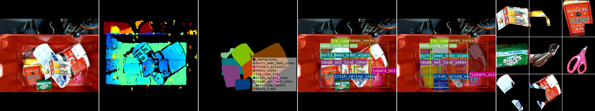
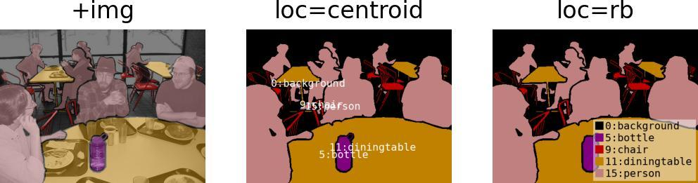
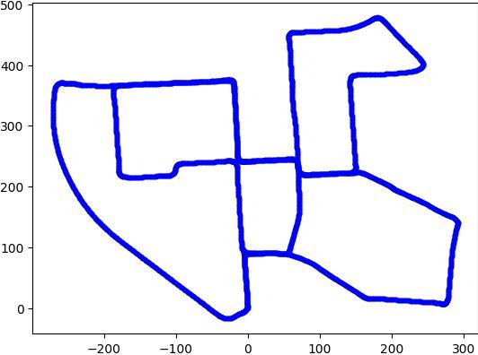

<!-- DO NOT EDIT THIS FILE MANUALLY. This file is generated by generate_readme.py. -->

<h1 align="center">
  imgviz
</h1>

<h4 align="center">
  Image Visualization Tools
</h4>

<div align="center">
  <a href="https://pypi.python.org/pypi/imgviz"></a>
  <a href="https://pypi.org/project/imgviz"></a>
  <a href="https://travis-ci.com/wkentaro/imgviz"></a>
</div>

<br/>

<div align="center">
  
</div>

## Installation

```bash
pip install imgviz

# there are optional dependencies like skimage, below installs all.
pip install imgviz[all]
```


## Dependencies

- [matplotlib](https://pypi.org/project/matplotlib)
- [numpy](https://pypi.org/project/numpy)
- [Pillow](https://pypi.org/project/Pillow)

## Getting Started

```python
# getting_started.py

import imgviz


# sample data of rgb, depth, class label and instance masks
data = imgviz.data.arc2017()

# colorize depth image with JET colormap
depth = data['depth']
depthviz = imgviz.depth2rgb(depth, min_value=0.3, max_value=1)

# colorize label image
class_label = data['class_label']
labelviz = imgviz.label2rgb(class_label, label_names=data['class_names'])

# instance bboxes
rgb = data['rgb']
bboxes = data['bboxes'].astype(int)
labels = data['labels']
captions = [data['class_names'][l] for l in labels]
bboxviz = imgviz.instances2rgb(image=rgb, bboxes=bboxes, labels=labels, captions=captions)

# instance masks
masks = data['masks'] == 1
maskviz = imgviz.instances2rgb(image=rgb, masks=masks, labels=labels, captions=captions)

# tile instance masks
insviz = [(rgb * m[:, :, None])[b[0]:b[2], b[1]:b[3]] for b, m in zip(bboxes, masks)]
insviz = imgviz.tile(imgs=insviz, border=(255, 255, 255))

# tile visualization
tiled = imgviz.tile(
    [rgb, depthviz, labelviz, bboxviz, maskviz, insviz],
    shape=(2, 3),
    border=(255, 255, 255),
)
```

## [Examples](examples)

<table>
	<tr>
		<td><pre><a href="examples/centerize.py">examples/centerize.py</a></pre></td>
		<td></td>
	</tr>
	<tr>
		<td><pre><a href="examples/depth2rgb.py">examples/depth2rgb.py</a></pre></td>
		<td></td>
	</tr>
	<tr>
		<td><pre><a href="examples/draw.py">examples/draw.py</a></pre></td>
		<td></td>
	</tr>
	<tr>
		<td><pre><a href="examples/flow2rgb.py">examples/flow2rgb.py</a></pre></td>
		<td></td>
	</tr>
	<tr>
		<td><pre><a href="examples/instances2rgb.py">examples/instances2rgb.py</a></pre></td>
		<td></td>
	</tr>
	<tr>
		<td><pre><a href="examples/label2rgb.py">examples/label2rgb.py</a></pre></td>
		<td></td>
	</tr>
	<tr>
		<td><pre><a href="examples/nchannel2rgb.py">examples/nchannel2rgb.py</a></pre></td>
		<td></td>
	</tr>
	<tr>
		<td><pre><a href="examples/plot_trajectory.py">examples/plot_trajectory.py</a></pre></td>
		<td></td>
	</tr>
	<tr>
		<td><pre><a href="examples/resize.py">examples/resize.py</a></pre></td>
		<td></td>
	</tr>
	<tr>
		<td><pre><a href="examples/tile.py">examples/tile.py</a></pre></td>
		<td></td>
	</tr>
</table>
